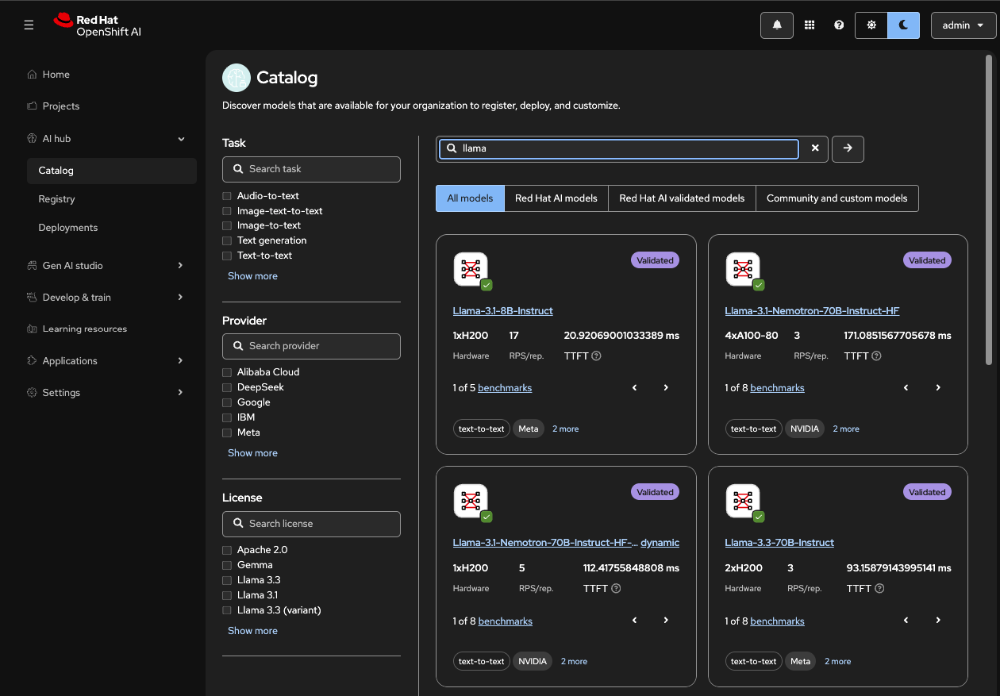
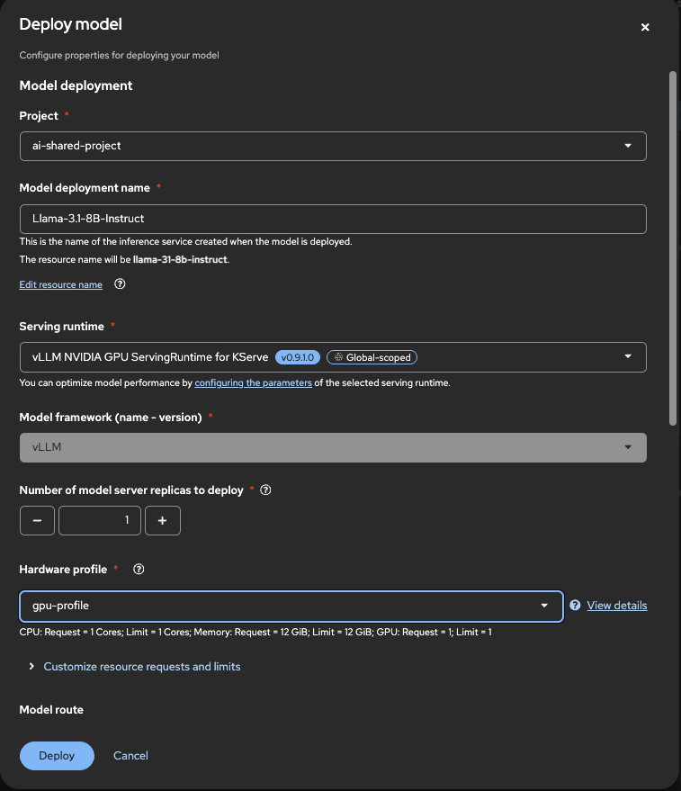
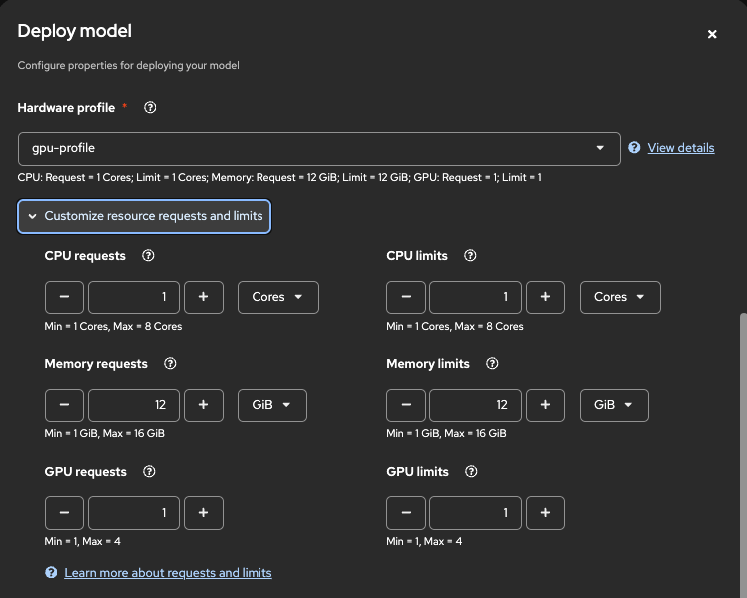
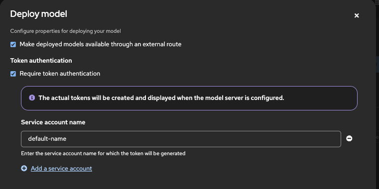
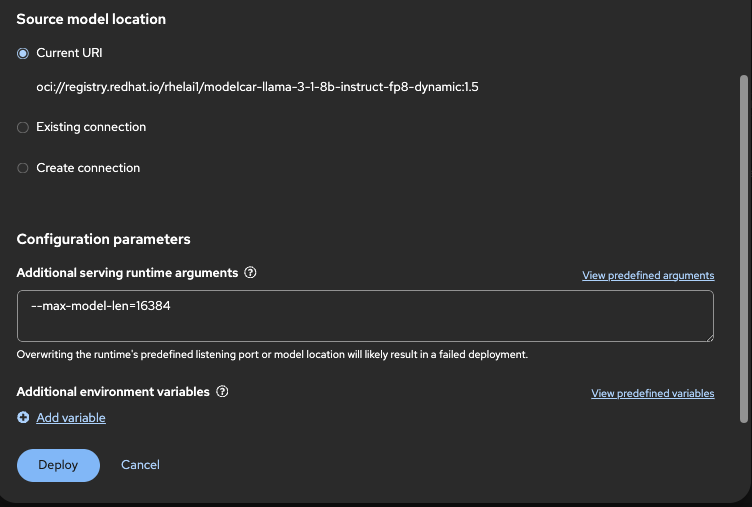
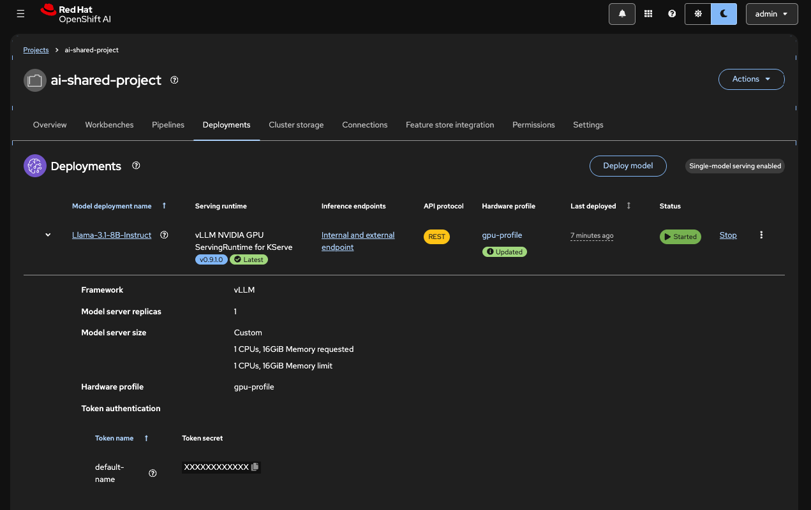

# Workshop 01: Deploy Model from Catalog

## Set Environment Variables

Before starting, set the following environment variable to simplify the commands throughout this workshop:

```bash
# Set your project namespace
export PROJECT_NAME="ai-shared-project"  # Replace with your actual project name
```

## Step 1: Create Your Project

Create a new project for your model deployment. You can use either method:

**Option A: Using the provided namespace YAML**

Edit `deploy/00-initial-config/namespace.yaml` and replace `<YOUR_PROJECT_NAME>` with your project namespace, then apply:

```bash
oc apply -f deploy/00-initial-config/namespace.yaml
```

**Option B: Create project manually**
```bash
oc new-project ${PROJECT_NAME}
```

## Step 2: Deploy Model from Catalog

### 2.1 Access the Model Catalog

1. Open the **OpenShift AI Console**
2. Navigate to **AI Hub** → **Catalog** menu
3. Browse and select the model you want to deploy



### 2.2 Configure Model Deployment

Click on **Deploy** and configure the following settings:

**Basic Configuration:**
- **Project:** Select your project namespace (e.g., `${PROJECT_NAME}`)
- **Model Deployment Name:** `Llama-3.1-8B-Instruct`
- **Serving runtime:** `vLLM NVIDIA GPU ServingRuntime for Kserve`
- **Model framework (name - version):** `vLLM` (pre-filled)
- **Number of model server replicas to deploy:** `1`
- **Hardware profile:** `gpu-profile`



### 2.3 Customize Resource Requests and Limits

Click on **Customize resource requests and limits** and configure:

- **CPU request:** `1`
- **CPU limit:** `2`
- **Memory request:** `16Gi`
- **Memory limit:** `24Gi`
- **GPU request:** `1`
- **GPU limit:** `1`



### 2.4 Enable External Route and Authentication

Check the following options:

- ✅ **Make deployed models available through an external route**
- ✅ **Require token authentication**



### 2.5 Configure Serving Runtime Arguments

In the **Configuration parameters** section, under **Additional serving runtime arguments**, add:

```bash
--max-model-len=16384
```



### 2.6 Deploy the Model

Click on **Deploy** to start the deployment process.



## Step 3: Verify Deployment

Monitor the deployment status:

```bash
oc get inferenceservice -n ${PROJECT_NAME}
```

Wait for the service to show `READY: True`. This may take several minutes as the model container is being pulled and started.

## Troubleshooting

If the deployment fails or takes too long:

1. Check pod status:
   ```bash
   oc get pods -n ${PROJECT_NAME}
   ```

2. Check pod logs:
   ```bash
   # First, get the pod name
   POD_NAME=$(oc get pods -n ${PROJECT_NAME} -l serving.kserve.io/inferenceservice -o jsonpath='{.items[0].metadata.name}')
   oc logs ${POD_NAME} -n ${PROJECT_NAME}
   ```

3. Verify hardware profile is available:
   ```bash
   oc get hardwareprofile -n redhat-ods-applications
   ```