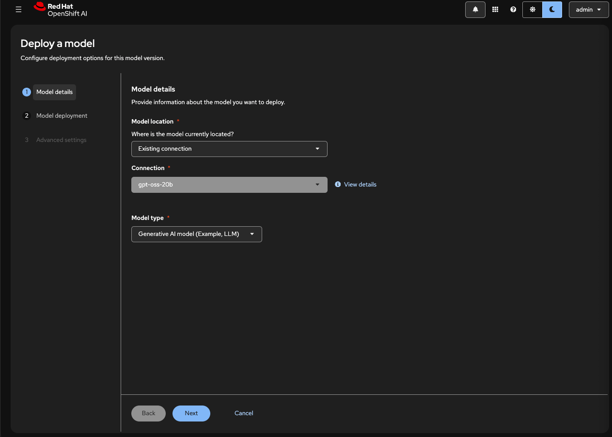
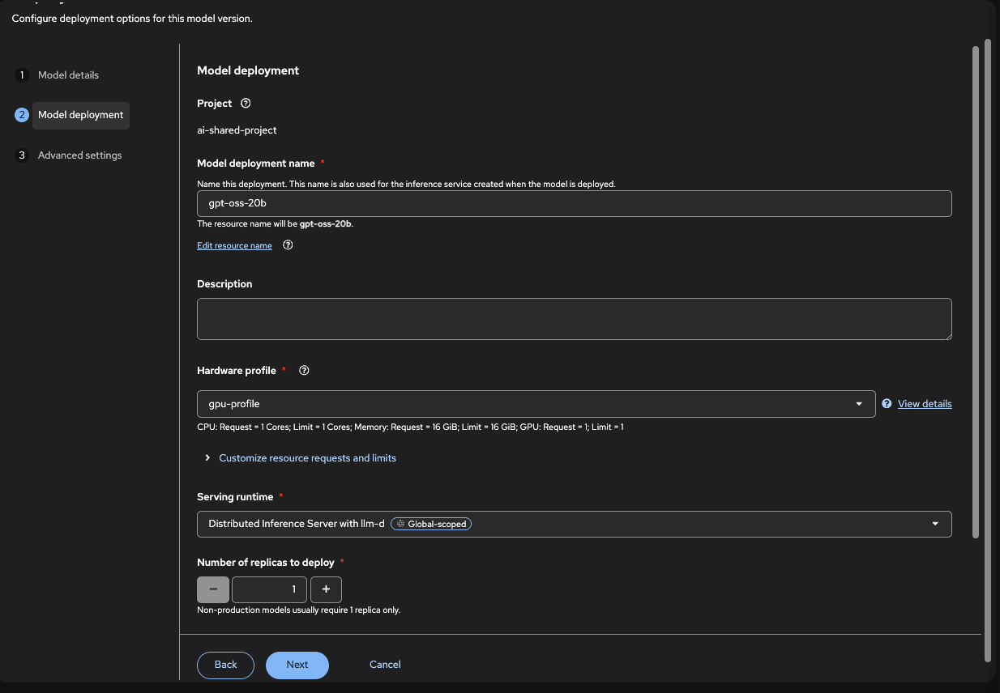
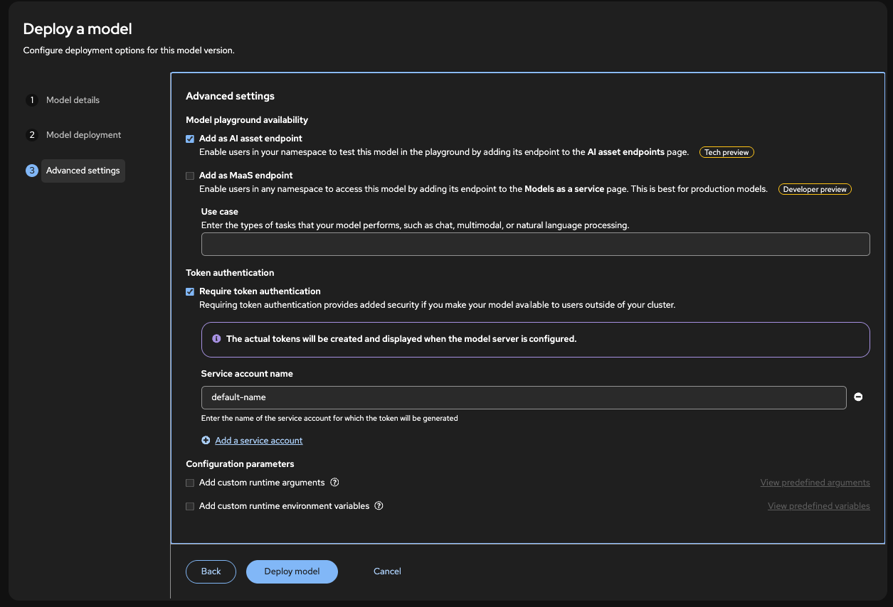

# Workshop 02: Deploy Model with LLM Deployments (LLM-D)

## Prerequisites

Before starting this workshop, ensure you have:

- Red Hat Build of Leader Worker Set Operator installed
- Cluster administrator privileges (all steps require cluster admin access)

**⚠️ IMPORTANT:** The order of operations is critical. Follow the steps in sequence, otherwise you won't get access to the models.

## Set Environment Variables

Before starting, set the following environment variables to simplify the commands throughout this workshop:

```bash
# Set your project namespace
export PROJECT_NAME="ai-shared-project"  # Replace with your actual project name

# Set your cluster domain (automatically retrieved from cluster)
export CLUSTER_DOMAIN=$(oc get ingresses.config/cluster -o jsonpath='{.spec.domain}')

# Set your service name (you'll know this after creating the connection in Step 7)
export SERVICE_NAME="qwen-25-7b"        # Replace with your actual service name
```

**Verify your environment variables are set correctly:**

```bash
echo "PROJECT_NAME: $PROJECT_NAME"
echo "CLUSTER_DOMAIN: $CLUSTER_DOMAIN"
echo "SERVICE_NAME: $SERVICE_NAME"
```

**Note:** You can set `SERVICE_NAME` later, after you know what name you'll use for your model deployment. For now, you can use a placeholder or set it when you reach Step 8.

## Step 1: Configure Gateway for Inference Service

### 1.0 Download Gateway from Cluster (if it exists)

**What we're doing:** If the Gateway `openshift-ai-inference` already exists in your cluster, we'll download its current configuration to preserve any existing settings (such as allowed namespaces or custom configurations) before making modifications. This ensures we don't lose any existing configuration when updating the Gateway.

**Download the Gateway configuration:**

```bash
oc get gateway openshift-ai-inference -n openshift-ingress -o yaml > deploy/02-llm-d/gateway.yaml
```

**What you'll see:** After running this command, the Gateway configuration will be saved to `deploy/02-llm-d/gateway.yaml`. The file will contain the complete Gateway resource definition, including:

- Gateway metadata (name, namespace, labels)
- GatewayClass reference
- Listener configuration with allowed routes
- TLS certificate references
- Hostname configuration

**Example of what the downloaded file will look like:**

```yaml
apiVersion: gateway.networking.k8s.io/v1
kind: Gateway
metadata:
  labels:
    istio.io/rev: openshift-gateway
  name: openshift-ai-inference
  namespace: openshift-ingress
spec:
  gatewayClassName: openshift-ai-inference
  listeners:
    - allowedRoutes:
        namespaces:
          from: Selector
          selector:
            matchExpressions:
              - key: kubernetes.io/metadata.name
                operator: In
                values:
                  - openshift-ingress
                  - redhat-ods-applications
                  # Your existing namespaces will be listed here
      hostname: inference-gateway.apps.your-cluster-domain.com
      name: https
      port: 443
      protocol: HTTPS
      tls:
        certificateRefs:
          - group: ''
            kind: Secret
            name: default-gateway-tls
        mode: Terminate
```

**Note:** If the Gateway doesn't exist yet, you can skip this step and proceed to edit the template file in the repository. The template file already contains the basic structure, and you'll just need to replace the placeholders in the next step.

### 1.1 Edit Gateway Configuration

Before applying the Gateway, edit `deploy/02-llm-d/gateway.yaml` and configure it based on your scenario:

**If you downloaded the Gateway from the cluster (Step 1.0):**
- The hostname already has your cluster domain configured correctly
- You only need to **add `${PROJECT_NAME}`** to the `values` array in the `allowedRoutes` section

**If you're using the template file (Gateway doesn't exist yet):**
- **Replace `<YOUR_PROJECT_NAME>`** with `${PROJECT_NAME}` (the value you set in the environment variables)
- **Replace `<CLUSTER_DOMAIN>`** with `${CLUSTER_DOMAIN}` (the value you set in the environment variables)

**Adding your namespace to allowed routes:**

Add `${PROJECT_NAME}` to the `values` array in the `allowedRoutes` section. This is important to allow your namespace to create HTTPRoutes for your model deployments.

**Example:** Add your namespace (the value of `${PROJECT_NAME}`) to the `values` array. If `${PROJECT_NAME}` is set to `ai-shared-project`, your configuration should look like:
```yaml
values:
  - openshift-ingress
  - redhat-ods-applications
  - ai-shared-project  # Replace with the actual value of ${PROJECT_NAME}
```

**Security Note:** You can allow all namespaces by changing `from: Selector` to `from: All`, but this can be a security risk as it allows any namespace to create HTTPRoutes that could hijack or deny traffic.

### 1.2 Apply Gateway Resources

Create the GatewayClass and Gateway:

```bash
oc apply -f deploy/02-llm-d/gateway-class.yaml
oc apply -f deploy/02-llm-d/gateway.yaml
```

**Note:** If you see warnings about missing `kubectl.kubernetes.io/last-applied-configuration` annotation, this is expected and can be safely ignored. The annotation will be added automatically.

Verify the Gateway was created:

```bash
oc get gateway -n openshift-ingress
```

## Step 2: Install Leader Worker Set Operator

The Leader Worker Set Operator is required for LLM Deployments (LLM-D) to function properly. This operator enables distributed inference by managing leader and worker pods that work together to serve large language models efficiently across multiple nodes.

**Why is it needed?**
- **Distributed Inference**: LLM-D uses a leader-worker architecture where one leader pod coordinates inference requests across multiple worker pods
- **Scalability**: Allows you to scale model inference horizontally by adding more worker pods
- **Resource Optimization**: Distributes the computational load of large models across multiple GPUs and nodes

Install the LeaderWorkerSet Operator and create an operator instance:

```bash
oc apply -f deploy/02-llm-d/leader-worker-set-operator.yaml
```

Verify the operator is running:

```bash
oc get pods -n openshift-lws-operator
```

You should see pods related to the Leader Worker Set Operator. If no pods appear immediately, wait a few moments for the operator to be deployed and then check again.

## Step 3: Create Kuadrant System Namespace

Create the namespace for Kuadrant components:

```bash
oc new-project kuadrant-system
```

## Step 4: Install Red Hat Connectivity Link (RHCL) Operator

**⚠️ CRITICAL:** The RHCL Operator **MUST** be installed in the `kuadrant-system` namespace. In RHOAI 3.0, this namespace is hard-coded, and installing RHCL in any other namespace will cause failures. RHCL will automatically install all other required operators (Authorino, ServiceMesh, DNS, Limitador) in this namespace.

1. Navigate to **Operator Hub** in the OpenShift Console
2. Search for "Red Hat Connectivity Link" or "RHCL"
3. Install the operator in the `kuadrant-system` namespace

**Note:** If you encounter "Internal Server Error" after deploying models or creating Kuadrant, it may be because RHCL was installed in the wrong namespace. The solution is to redeploy RHCL in the `kuadrant-system` namespace.

### 4.1 Restart Controllers After RHCL Installation

After installing RHCL, restart the following controllers to ensure they pick up the new configuration:

```bash
# Restart kserve-controller-manager
oc rollout restart deployment/kserve-controller-manager -n redhat-ods-applications
oc rollout status deployment/kserve-controller-manager -n redhat-ods-applications --timeout=120s

# Restart odh-model-controller
oc rollout restart deployment/odh-model-controller -n redhat-ods-applications
oc rollout status deployment/odh-model-controller -n redhat-ods-applications --timeout=120s
```

Verify both controllers are running:

```bash
oc get pods -n redhat-ods-applications | grep -E "kserve-controller-manager|odh-model-controller"
```

## Step 5: Create Kuadrant Instance

Kuadrant is an API management solution for Kubernetes that provides authentication, authorization, and rate limiting capabilities. In the context of LLM-D, Kuadrant is used to secure and manage access to your deployed models through the Gateway API.

**Why is it needed?**
- **API Security**: Provides authentication and authorization for model endpoints, ensuring only authorized users can access your deployed models
- **Traffic Management**: Enables rate limiting and traffic control to protect your models from being overwhelmed
- **Gateway Integration**: Works seamlessly with the Gateway API to apply security policies at the network level
- **OpenShift Integration**: Uses OpenShift's built-in authentication mechanisms (like ServiceAccount tokens) for seamless integration

### 5.1 Create Kuadrant Instance

Create a Kuadrant instance:

```bash
oc apply -f deploy/02-llm-d/kuadrant.yaml
```

Verify the Kuadrant instance is created:

```bash
oc get kuadrant -n kuadrant-system
```

**⚠️ TROUBLESHOOTING:** If you encounter "Internal Server Error" (HTTP 500) when calling your model endpoint after creating Kuadrant, this is a known issue. The problem occurs when RHCL was not deployed in the `kuadrant-system` namespace. In RHOAI 3.0, this namespace is hard-coded and RHCL must be in this namespace.

**Solution:**
1. Verify RHCL is installed in `kuadrant-system`:
   ```bash
   oc get subscription -n kuadrant-system | grep -i rhcl
   ```

2. If RHCL is not in `kuadrant-system`, you need to:
   - Uninstall RHCL from its current namespace
   - Reinstall RHCL in the `kuadrant-system` namespace
   - Restart the controllers (as shown in Step 4.1)

3. After fixing RHCL, restart Kuadrant:
   ```bash
   oc delete kuadrant kuadrant -n kuadrant-system
   oc apply -f deploy/02-llm-d/kuadrant.yaml
   ```

## Step 6: Configure Authorino Service

Authorino is an authentication and authorization engine that works with Kuadrant to enforce security policies on your API endpoints. It handles the actual authentication logic, token validation, and authorization decisions for requests coming through the Gateway.

**Why is it needed?**
- **Authentication Engine**: Validates tokens and credentials for incoming requests to your model endpoints
- **Authorization Logic**: Enforces access control policies defined in AuthPolicy resources
- **TLS Security**: Provides secure communication through TLS certificates
- **Integration with Kuadrant**: Works together with Kuadrant to provide a complete API security solution

### 6.1 Annotate Authorino Service

Annotate the Authorino service to enable TLS certificates. Only one annotation needs to be created; two others will be created automatically:

```bash
oc annotate svc/authorino-authorino-authorization \
  service.beta.openshift.io/serving-cert-secret-name=authorino-server-cert \
  -n kuadrant-system
```

### 6.2 Enable SSL in Authorino

Update the Authorino object to enable SSL by applying the configuration:

```bash
oc apply -f deploy/02-llm-d/authorino.yaml
```

**Note:** If you see a warning about missing `kubectl.kubernetes.io/last-applied-configuration` annotation, this is expected and can be safely ignored. The annotation will be added automatically.

The Authorino configuration includes TLS settings in the listener section. Verify the configuration:

```bash
oc get authorino -n kuadrant-system -o yaml
```

## Step 7: Create Model Connection

### 7.1 Access OpenShift AI Console

1. Navigate to your project in the OpenShift AI Console
2. Go to **Connections** → **Create Connection**

### 7.2 Configure Connection


**Connection Type:**
- Select: `URI - v1`

**Connection name:**
- Enter: `qwen-25-7b`

**Connection URI:**
```
oci://registry.redhat.io/rhelai1/modelcar-qwen2-5-7b-instruct-fp8-dynamic:1.5
```

## Step 8: Deploy LLM Inference Service

After creating the connection, you can deploy an LLM Inference Service using the connection you just created.

Go to the **AI Hub** → **Deployments** menu, make sure you are in your selected project. Click on **Deploy Model** to start deploying your LLM model using the connection created in the previous step.

### 8.0 Deploy Model using Existing Connection

To deploy a Generative AI model (such as an LLM) using an **existing Connection**, follow these steps in the OpenShift AI Console:

1. In the **Deploy Model** wizard, under **Model Location**, select **Existing Connection**.
2. For **Connection**, choose:  
   ```
   qwen-25-7b
   ```
3. For **Model type**, select:  
   ```
   Generative AI model (Example LLM)
   ```
4. Click **Next** to continue.




### 8.0.1 Configure Model Deployment

Set the following options in the **Deploy Model** wizard:

- **Model deployment name:** `qwen-25-7b`
- **Hardware profile:** `gpu-profile`
- **Serving runtime:** `Distributed Inference Server with llm-d`
- **Number of replicas to deploy:** `1`

Click **Next** to continue.




### 8.0.2 Advanced Settings

In the **Advanced settings** section of the **Deploy Model** wizard:

- Enable **Add as AI asset endpoint** by checking the checkbox.  
  This allows your deployed model to be used as an AI asset in the AI app development playground.

- **Require token authentication** (optional):  
  This option requires a valid authentication token to access your deployed model via the endpoint.  
  **⚠️ For this workshop, do NOT enable this option.** Leave this checkbox unchecked.

**⚠️ IMPORTANT:** Do NOT add vLLM arguments to your configuration. Adding vLLM arguments will break the deployment due to a known bug (RHOAIENG-38896). Leave the configuration parameters section empty or use only the default values.

After configuring these options, click **Deploy model** to initiate the deployment.

**Note:** The UI may show "Failed" initially, but the deployment is proceeding in the background. Wait for the deployment to complete and eventually it will be tagged as "Started".




### 8.1 Verify HTTPRoutes

Check if HTTPRoutes are being created for your LLM Inference Service:

```bash
oc get httproute -n ${PROJECT_NAME}
```

### 8.2 Check LLM Inference Service Status

Monitor the status of your LLM Inference Service:

```bash
oc get LLMInferenceService -n ${PROJECT_NAME}
```

The service should show `READY: True` once the HTTPRoutes are properly configured and the Gateway allows traffic from your namespace.

## Verification Steps

After completing the deployment, verify everything is working correctly:

### Verify Gateway Configuration

```bash
# Check Gateway status (should show READY: True)
oc get gateway openshift-ai-inference -n openshift-ingress

# Verify your namespace is in allowedRoutes
oc get gateway openshift-ai-inference -n openshift-ingress -o yaml | grep -A 10 "allowedRoutes"
```

### Verify LLM Inference Service

```bash
# Check service status (should show READY: True)
oc get LLMInferenceService -n ${PROJECT_NAME}

# Verify HTTPRoutes were created
oc get httproute -n ${PROJECT_NAME}
```

### Verify Components

```bash
# Check Authorino is running
oc get pods -n kuadrant-system | grep authorino

# Check Kuadrant instance
oc get kuadrant -n kuadrant-system
```

## Verification Checklist

- [ ] GatewayClass created
- [ ] Gateway created and ready
- [ ] Gateway allows your project namespace
- [ ] Leader Worker Set Operator installed
- [ ] `kuadrant-system` namespace created
- [ ] RHCL Operator installed in `kuadrant-system`
- [ ] Kuadrant instance created
- [ ] Authorino service annotated
- [ ] Authorino SSL enabled
- [ ] Model connection created
- [ ] LLM Inference Service deployed
- [ ] HTTPRoutes created and ready
- [ ] LLM Inference Service shows `READY: True`